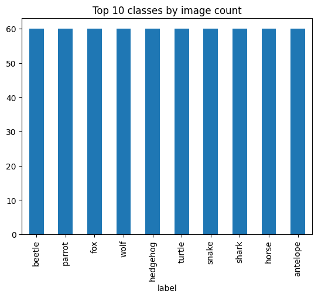
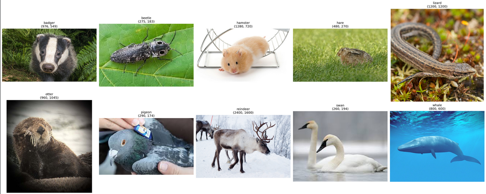
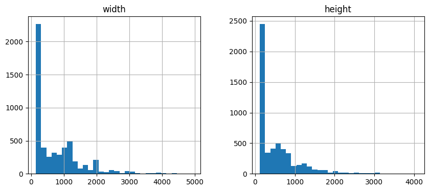
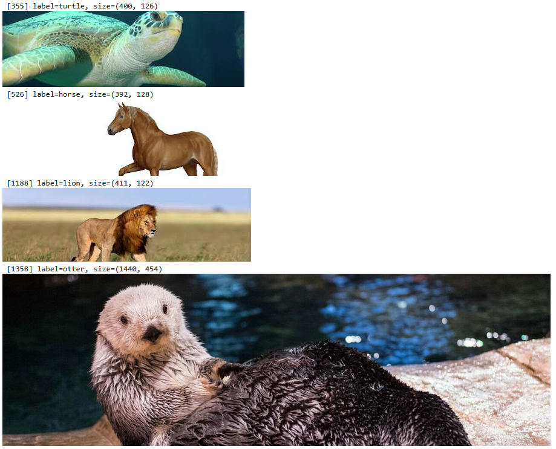
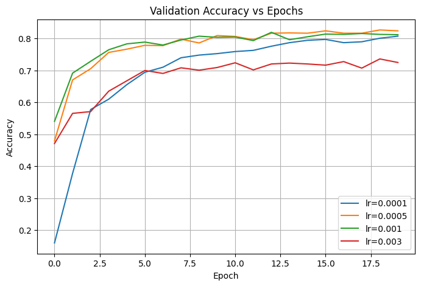
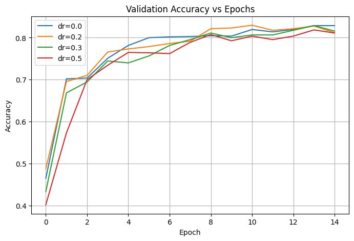
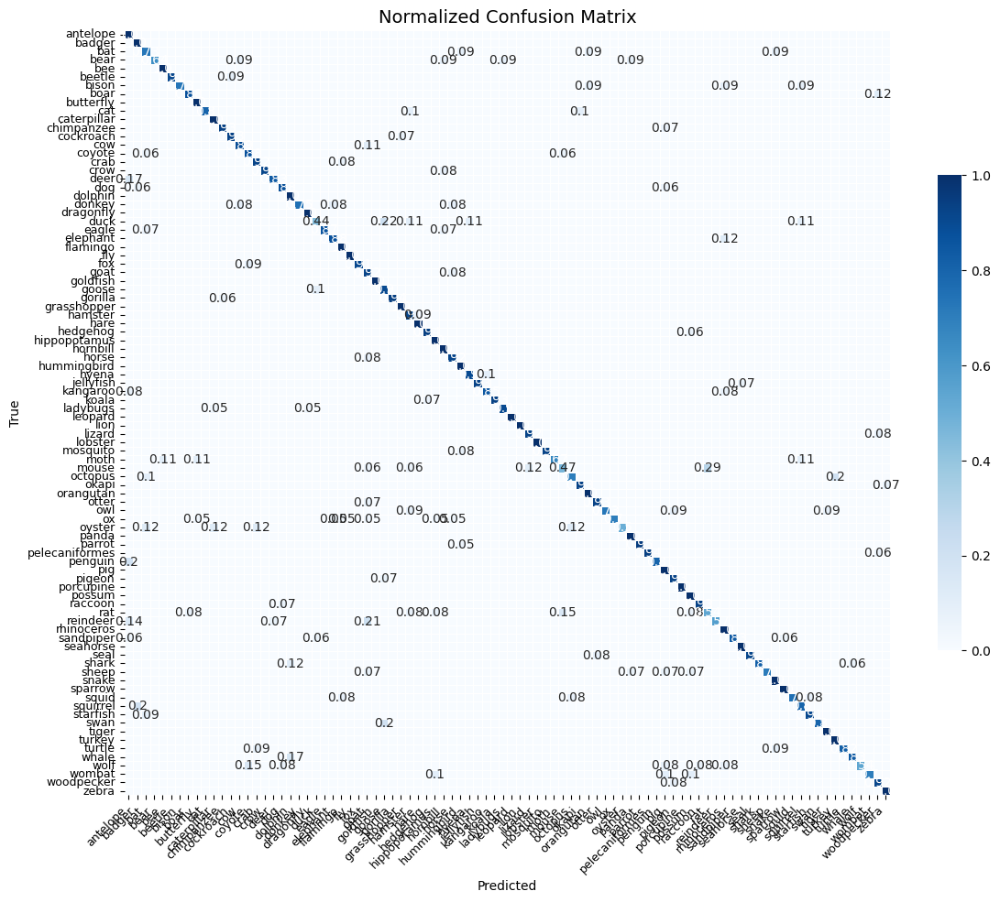
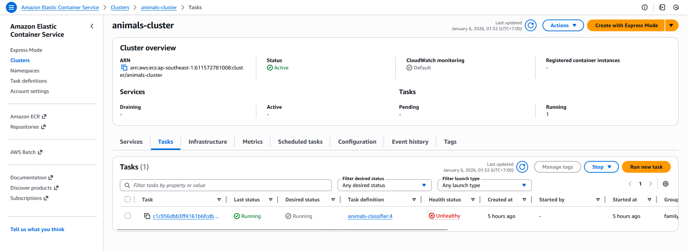
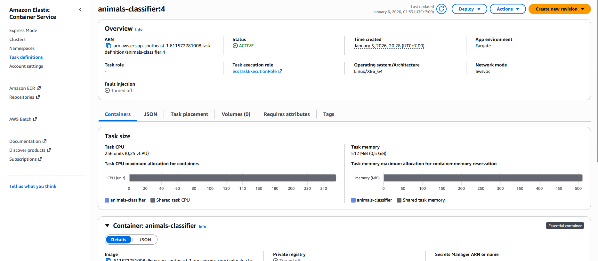
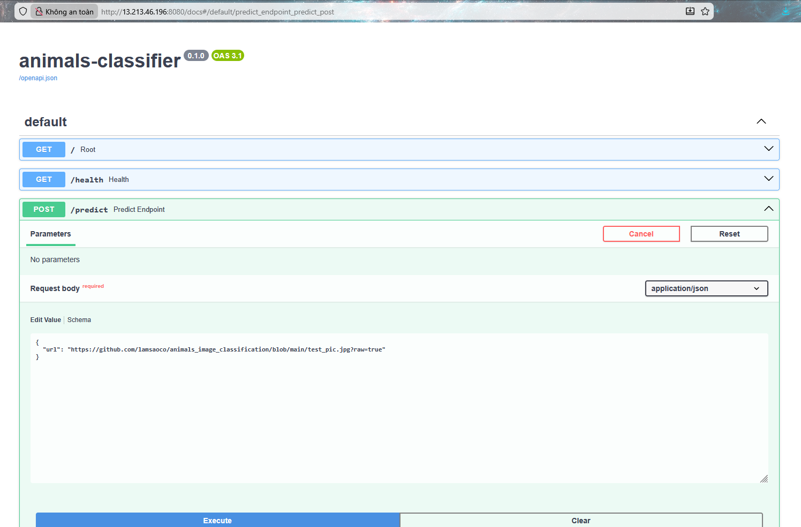

# 🐾 Animals Image Classification

The **Animals Image Classification** project focuses on the task of **animal image classification** using **Deep Learning** techniques. The project applies **Convolutional Neural Networks (CNNs)** combined with **Transfer Learning**, leveraging **ResNet18** as the backbone model.

The main goal is to build a complete end-to-end pipeline, from data preparation and model training to evaluation and inference deployment.

---

## 📌 Project Overview

* **Problem Type**: Image Classification
* **Domain**: Animal images (multiple animal species)
* **Approach**: CNN with Transfer Learning
* **Backbone Model**: ResNet18 (pretrained on ImageNet)
* **Framework**: PyTorch

---

## 📊 Dataset

* **Source**: Kaggle – Animal Image Dataset (90 Different Animals)

* **Author**: Sourav Banerjee
* **Link**: https://www.kaggle.com/datasets/iamsouravbanerjee/animal-image-dataset-90-different-animals
* **Total Classes**: 90 animal species
* **Total Images**: 5,400 images
* **Download**: 
  * Option 1: Do it manually, Click in the link above and download it then unzip
  * Option 2: Run this in your jupyter notebook or python scripts:

```python
import kagglehub

# Download dataset from Kaggle
path = kagglehub.dataset_download(
    "iamsouravbanerjee/animal-image-dataset-90-different-animals"
)

print("Path to dataset files:", path)
```

---

## 🔍 Exploratory Data Analysis (EDA)

**Distribution of classes** :



**Some pictures in Dataset** :
  


**Distribution of width and height** :



**Filter “abnormal” images** :


---

## 🧠 Model Architecture

* Uses **ResNet18** pretrained on the ImageNet dataset
* The final fully connected layer is replaced to match the number of animal classes
* Fine-tuning is applied to improve performance on the target dataset

---

## 📂 Project Structure

```text
animals_image_classification/
│
├── notebook.ipynb        # Jupyter notebooks for EDA and experiments
├── Model_FIles/          # Saved checkpoints
├── app.py                # API script
├── train.py              # Final model training script
├── predict.py            # Model testing script
├── requirements.txt      # Python dependencies
│
│
├── Dockerfile            # Docker configuration for deployment
│
│
├── .python-version       # Python version specification
├── pyproject.toml        # Project metadata and dependencies
├── uv.lock               # Locked dependency versions (uv)
└── README.md             # Project documentation
```

---

## 🗂️ Data Preparation

Split all images into train / validation / test

```python
# Split dataset into train, val, test dataset
df_full_train, df_test = train_test_split(df, test_size=0.2, random_state=42)
df_train, df_val = train_test_split(df_full_train, test_size=0.25, random_state=42)

df_full_train = df_full_train.reset_index(drop=True)
df_train = df_train.reset_index(drop=True)
df_val = df_val.reset_index(drop=True)
df_test = df_test.reset_index(drop=True)
```

Apply image transformations and normalization

```python
# Pre-processing images input
IMG_SIZE = 224
BATCH_SIZE = 20

train_transform = transforms.Compose([
  transforms.Resize((IMG_SIZE, IMG_SIZE)),
  transforms.RandomHorizontalFlip(),
  transforms.RandomRotation(20),
  transforms.ToTensor(),
  transforms.Normalize(
      mean=[0.485, 0.456, 0.406],
      std =[0.229, 0.224, 0.225]
  )
])
```

Create DataLoader

```python
# Create DataLoader
train_ds = ImageDFDataset(df_train, transform=train_transform)
val_ds   = ImageDFDataset(df_val, transform=val_transform)

train_loader = DataLoader(
    train_ds,
    batch_size=BATCH_SIZE,
    shuffle=True,
    num_workers=2,
    pin_memory=True
)

val_loader = DataLoader(
    val_ds,
    batch_size=BATCH_SIZE,
    shuffle=False,
    num_workers=2,
    pin_memory=True
)

val_transform = transforms.Compose([
    transforms.Resize((IMG_SIZE, IMG_SIZE)),
    transforms.ToTensor(),
    transforms.Normalize(
        mean=[0.485, 0.456, 0.406],
        std =[0.229, 0.224, 0.225]
    )
])
```

---

## ⚙️ Model Training

Load pretrained ResNet18 and replace classification head:
 
```python
# Rebuild model with backbone resnet18
class AnimalClassification(nn.Module):
    def __init__(self, size_inner=256, droprate=0.2, num_classes=90):
        super(AnimalClassification, self).__init__()

        # Load pretrained ResNet18
        self.base_model = models.resnet18(weights="IMAGENET1K_V1")

        # Freeze backbone
        for param in self.base_model.parameters():
            param.requires_grad = False

        # Remove original FC layer
        in_features = self.base_model.fc.in_features
        self.base_model.fc = nn.Identity()

        # Custom head
        self.inner = nn.Linear(in_features, size_inner)
        self.relu = nn.ReLU()
        self.dropout = nn.Dropout(droprate)
        self.output_layer = nn.Linear(size_inner, num_classes)

    def forward(self, x):
        x = self.base_model(x)          # (B, 512)
        x = self.inner(x)
        x = self.relu(x)
        x = self.dropout(x)
        x = self.output_layer(x)
        return x
```

Train using cross-entropy loss and an optimizer Adam

```python
# Here we have 90 classes so I use CrossEntropyLoss
criterion = nn.CrossEntropyLoss()

# Create make model function, later use to tune params
def make_model(learning_rate=0.0001, size_inner=256, droprate=0.3):
    model = AnimalClassification(
        size_inner=size_inner,
        droprate=droprate,
        num_classes=90
    ).to(device)
    
    optimizer = torch.optim.Adam(
        filter(lambda p: p.requires_grad, model.parameters()),
        lr=learning_rate
    )
    return model, optimizer
```

 Tuning with learning rate
  
 

Tuning with dropout rate
    


Tuning with augmentation:

```python
train_transform = transforms.Compose([
    transforms.RandomHorizontalFlip(p=0.5),  
    transforms.RandomRotation(degrees=27),  # 0.15 * 180 ≈ 27 độ
    transforms.RandomResizedCrop(
        size=224,
        scale=(0.85, 1.0)  # zoom ~15%
    ),
    transforms.ColorJitter(
        contrast=0.15
    ),
    transforms.ToTensor(),
    transforms.Normalize(
        mean=[0.485, 0.456, 0.406],
        std=[0.229, 0.224, 0.225]
    )
])
```

---

## 📈 Evaluation

Measure on test sets:
* Accuracy: 0.8898
* Precision (macro): 0.8845
* Recall (macro):    0.8800
* F1-score (macro):  0.8705

Confusion matrix:



---
    
## 📡 Deployment

Load best trained model:
```python
list_of_files = glob.glob('Model_Files/animals_classification_*.pth')
latest_file = max(list_of_files, key=os.path.getctime)
print(f"Loading the best model from: {latest_file}")
```

Convert it into onnx file
```python
!pip install onnx

# Define dummy input for ONNX export
# The input shape should match the input shape of your model (batch_size, channels, height, width)
# Use a batch size of 1 for simplicity when exporting
dummy_input = torch.randn(1, 3, 224, 224).to(device)

# Export the model to ONNX format
onnx_path = "animals_classification_latest.onnx"

torch.onnx.export(
    model,                     # PyTorch Model
    dummy_input,               # Dummy input tensor
    onnx_path,                 # Path to save the ONNX model
    verbose=True,              # Print export details
    input_names=['input'],     # Input layer name
    output_names=['output'],   # Output layer name
    dynamic_axes={             # Dynamic batch size
        'input' : {0 : 'batch_size'},
        'output' : {0 : 'batch_size'}
    }
)

print(f"Model exported to {onnx_path}")
```

 Create api predict app with fastapi (detail in "app.py")

---

## 🛠️ Environment Setup & Dependency Management

This project uses uv for environment and dependency management to ensure reproducibility across different systems. uv handles the following:

* Creates an isolated virtual environment for the project.

* Synchronizes dependencies based on the lock file (uv.lock) to ensure consistent versions.

* Simplifies installation and updates of Python packages.

* Supports reproducible builds in both local development and Docker/CI environments.

Quick start:

```bash
# Sync the environment with dependencies
uv sync --locked
```

Using uv ensures that all developers and deployment environments run the project with the same package versions, avoiding "works on my machine" issues.

---

## 🐳 Containerize

This project uses Docker for containerization, which ensures that the application runs consistently across different environments. Containerization provides the following benefits:

* Packages the application along with all dependencies and system libraries into a single container.

* Guarantees consistent runtime behavior on any machine, whether local, CI/CD pipelines, or production servers.

* Simplifies deployment and scaling, as containers can be easily launched, stopped, and replicated.

* Supports integration with orchestration platforms like Kubernetes or cloud services.

Quick start:
```bash
# Build the Docker image
docker build -t animals-classification:v1 .

# Run the container
docker run -it -p 8080:8080 animals-classification:v1
```

---

## ☁️ Deploy on Cloud

This project supports deployment on Amazon Web Services (AWS) using Docker and ECR (Elastic Container Registry). The process ensures that the application is scalable, portable, and accessible over the internet.

Steps:

1. Install AWS CLI
Install the AWS Command Line Interface to interact with AWS services from your terminal.

```bash
curl "https://awscli.amazonaws.com/awscli-exe-linux-x86_64.zip" -o awscliv2.zip
unzip awscliv2.zip
sudo ./aws/install
aws --version
```

2. Configure AWS Credentials
Set up your AWS account credentials to authenticate deployment actions.

```bash
aws configure

# Type in your AWS account information:
# AWS Access Key ID: <key>
# AWS Secret Access Key: <secret>
# Default region name: ap-southeast-1
# Default output format: json
```

3. Create ECR Repository
Create an Elastic Container Registry repository to host Docker images.

```bash
aws ecr create-repository \
  --repository-name animals-classifier \
  --region ap-southeast-1

# Example repository URI:
# "repositoryUri": "<aws_account_id>.dkr.ecr.ap-southeast-1.amazonaws.com/animals-classifier"
```

4. Login to ECR
Authenticate Docker with AWS ECR for pushing images.

```bash
aws ecr get-login-password --region ap-southeast-1 \
| docker login --username AWS \
--password-stdin <aws_account_id>.dkr.ecr.ap-southeast-1.amazonaws.com/animals-classifier

aws sts get-caller-identity
```

5. Tag & Push Docker Image
Tag your local Docker image and push it to ECR.

```bash
docker tag animals-classifier:v1 <aws_account_id>.dkr.ecr.ap-southeast-1.amazonaws.com/animals-classifier:v1
docker push <aws_account_id>.dkr.ecr.ap-southeast-1.amazonaws.com/animals-classifier:v1
```

6. Create cluster on AWS website



7. Create task definition on AWS website and run it



8. Access Application API
Once deployed, the application can be accessed via the cloud-hosted API endpoint



Deploying on AWS ensures that the application is highly available, reproducible, and production-ready, eliminating "works on my machine" issues and enabling scaling in the cloud.

---

## 🚀 Getting Started

### 1. Install dependencies

```bash
pip install -r requirements.txt
```

### 2. Train the model

```bash
python train.py
```

### 3. Test the model

```bash
python predict.py
```

### 4. Run API script

```bash
python app.py
```

### 5. Test on cloud
Try this link: [API link](http://47.129.87.227:8080/docs)

---

## 📊 Key Techniques Used

* Exploratory Data Analysis (EDA)
* Pytorch
* Convolutional Neural Networks (CNN)
* Transfer Learning
* Data Augmentation
* Fine-tuning pretrained models
* Environment setup & Dependencies management
* Docker
* AWS Cloud (ECS, ECR)

---

## 📜 License

This project is intended for educational and research purposes.
